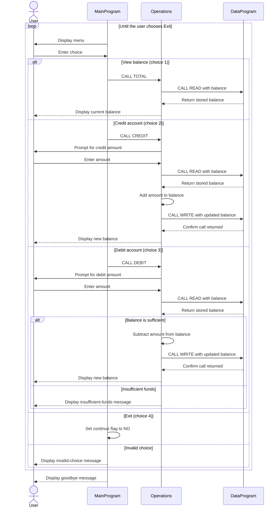

# COBOL Student Account Example

This directory documents the COBOL account-management example in `src/cobol/`. The program provides a menu for viewing an account balance, crediting the account, and debiting it.

## Source Files

- [`main.cob`](../src/cobol/main.cob) — `MainProgram` displays the menu, reads the user's choice, and calls `Operations` with the requested action. Choices 1 through 3 show the balance, credit the account, and debit the account; choice 4 exits. Other choices display an error and return to the menu.
- [`operations.cob`](../src/cobol/operations.cob) — `Operations` implements account actions. `TOTAL` reads and displays the balance; `CREDIT` accepts an amount, adds it to the balance, and saves it; `DEBIT` accepts an amount and saves the subtraction only when the current balance is sufficient.
- [`data.cob`](../src/cobol/data.cob) — `DataProgram` provides the balance storage interface. A `READ` operation copies the stored balance to the caller, and a `WRITE` operation replaces the stored balance.

## Account Rules and Limits

- The account starts with a balance of `1000.00` (`PIC 9(6)V99`). The implied decimal point means the value is stored with two decimal places.
- A debit is allowed when the requested amount is less than or equal to the current balance. If it is greater, the program displays an insufficient-funds message and leaves the balance unchanged.
- A credit adds the entered amount to the current balance. The code does not define a separate credit limit.
- Amounts are accepted directly into numeric fields; the program contains no explicit validation for positive amounts, malformed input, or exceeding the field's capacity.
- The stored balance is held in working storage, not in a file or database. It is shared across calls during a program run and starts over at `1000.00` on a new run.
- Despite the exercise's student-account context, the code models one generic account. It has no student identifiers, multiple-account selection, or student-specific eligibility or fee rules.

## Data Flow

